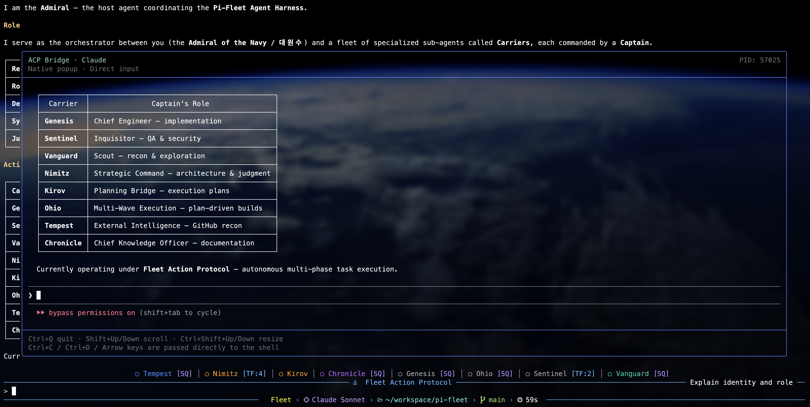
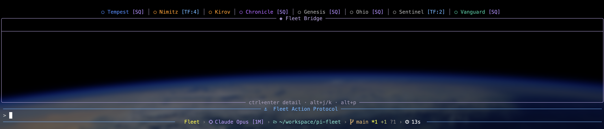
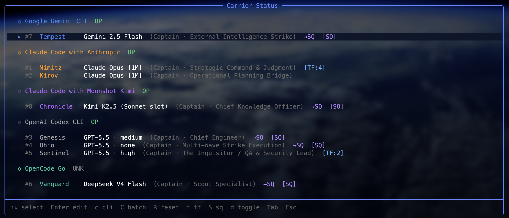

    <h1>pi-fleet</h1>
    
    <h3><em>One Fleet. All LLMs.</em></h3>

    <strong>Claude Code, Codex CLI, Gemini CLI를 하나의 통합 인터페이스로 운용하는 멀티 LLM 오케스트레이션 킷 — 네이티브 CLI를 직접 사용하며, API 래핑이나 프록싱 없음.</strong>

  <a href="README.md">English</a> |
  <a href="README.ko.md">한국어</a>

---

  <video src=".github/pi-fleet.mp4" width="640" controls></video>

## 동기

Claude Code, Codex, Gemini, OpenCode와 같은 모든 프론티어 CLI는 각자의 기반 모델에 최적화된 에이전트 루프를 탑재하고 있습니다. Claude의 루프는 심층 추론과 도구 오케스트레이션을 위해 설계되었고, Codex는 빠른 코드 생성과 반복 실행에 최적화되어 있습니다. Gemini는 방대한 컨텍스트 윈도우를 활용한 리서치와 종합에 특화되어 있으며, OpenCode는 여러 모델을 하나의 적응형 루프 아래 통합합니다. 이들은 얇은 API 래퍼가 아니라, 각 제작사가 세밀하게 다듬은 완전한 모델-네이티브 에이전트 런타임입니다.

문제는 이 모든 도구가 별도의 터미널에 존재한다는 점입니다. 하나의 작업에 여러 CLI의 강점을 조합하려면 창 사이로 컨텍스트를 복사하고, 상태를 수동으로 동기화하며, 각기 다른 상호작용 패턴 사이를 오가야 합니다. 다중 도구 조율의 마찰은 결국 단일 CLI에 만족하게 만들고, 나머지 도구의 고유한 능력은 활용하지 못한 채 남겨두게 됩니다.

pi-fleet는 이런 마찰을 제거하면서도 각 CLI의 본질을 훼손하지 않기 위해 만들어졌습니다. 모든 네이티브 에이전트 런타임을 해군 **함대(Fleet)** 내의 **항공모함(Carrier)**으로 대우하고, 중앙의 Admiral이 공식 프로토콜을 통해 여러 Carrier를 병렬로 지휘합니다. 각 모델의 네이티브 루프는 설계 그대로 실행되되, 단일 명령 아래 조율됩니다. 한 번의 명령으로 함대 전체가 함께 실행되며, 각 Carrier가 자신만의 강점을 기여합니다.

## 해군 함대 계층 구조

4단계 지휘 체계가 사용자, 오케스트레이터, 에이전트를 명확한 역할로 매핑합니다:

- **Admiral of the Navy (대원수)** — 사용자. 전략을 수립하고 명령을 내립니다.
- **Fleet Admiral (사령관)** — grand-fleet 모드의 다중 함대 오케스트레이터.
- **Admiral (제독)** — 워크스페이스 PI 인스턴스. 작전을 기획하고 Carrier를 배치합니다.
- **Captain (함장)** — Carrier 에이전트의 지휘관 페르소나.

**Carrier**는 독립된 설정을 가진 CLI 도구의 실행 인스턴스입니다. **Captain**은 이를 지휘하는 페르소나(예: Chief Engineer, Scout Specialist)입니다.

## 항공모함

> 각 항공모함의 설정(모델 선택, 추론 레벨 등)은 Fleet Bridge UI(`Alt+O`)에서 조정할 수 있습니다.

8개의 기본 Carrier가 각각 고유한 작전 역할을 수행합니다:

- **Nimitz** — 전략 지휘·판단. 읽기 전용 아키텍처 결정·트레이드오프 재결.
- **Kirov** — 작전 기획 브리지. 요구사항 명확화 및 Ohio에 전달할 plan_file 작성(.fleet/plans/*.md).
- **Genesis** — 수석 엔지니어. 제독 직접 지휘 하의 단발 구현.
- **Ohio** — 다단 파상 타격 집행. Kirov가 작성한 plan_file을 받아 웨이브 단위로 실행.
- **Sentinel** — QA & Security Lead. 코드 리뷰, 결함 탐지, 취약점 헌팅.
- **Vanguard** — Scout Specialist. 코드베이스 탐색, 심볼 추적, 웹 리서치.
- **Tempest** — 전방 외부 체보 타격. GitHub 인텔리전스 및 외부 레포 분석.
- **Chronicle** — Chief Knowledge Officer. 문서화, 변경 로그, 변경 영향 보고.

## 기능

### 멀티 LLM 오케스트레이션

pi-fleet는 API를 래핑하거나 프록시를 운용하지 않습니다 — **프론티어 CLI 도구를 네이티브로 직접 오케스트레이션**합니다. 각 Carrier는 실제 CLI 바이너리를 실행하고 공식 프로토콜(ACP 또는 App Server)을 통해 통신하므로, 각 도구의 완전한 네이티브 기능을 통합된 명령 구조 안에서 그대로 사용할 수 있습니다.

| CLI | 제공자 | 프로토콜 | 주요 기능 |
|-----|--------|----------|-----------|
| **Claude Code** | Anthropic | ACP | 심층 추론, 아키텍처 판단 |
| **Claude Code (Z.AI GLM)** | Z.AI | ACP | Claude 브리지를 통한 GLM-5 시리즈 |
| **Claude Code (Moonshot Kimi)** | Moonshot | ACP | Claude 브리지를 통한 Kimi K2 시리즈 |
| **Codex CLI** | OpenAI | App Server | 빠른 코드 생성, 다단계 실행 |
| **Gemini CLI** | Google | ACP | 대용량 컨텍스트 분석, 리서치 |
| **OpenCode Go** | OpenCode | ACP | DeepSeek, GLM, Kimi, MiMo, MiniMax, Qwen |

모든 Carrier가 단일 명령 구조 아래 병렬로 실행되며, 통합된 진행 상황 추적을 통해 전체 함대의 상태를 한눈에 파악할 수 있습니다. Carrier별로 모델 선택과 추론 레벨을 독립적으로 세밀하게 조정할 수 있으며, 작업의 특성에 따라 Fleet Action의 자율 실행 모드와 Positive Control의 수동 관리 모드를 전환할 수 있습니다.

### Fleet Bridge

Fleet Bridge는 당신의 임무 통제 센터입니다. 통합 헤즈업 디스플레이는 모든 정보를 하나의 화면에 담습니다 — 풀기능 에디터, 실시간 상태 표시줄, 그리고 세션 상태와 토큰 사용량, 비용을 추적하는 컨텍스트 푸터까지. 메타포 기반 지시어 정제는 복잡한 요청을 명확한 작전 구역으로 나누어 주며, 자동 세션 요약과 내장 씽킹 타이머로 워크플로우를 투명하고 측정 가능하게 유지합니다.

모든 활성 Carrier의 실시간 스트리밍 결과를 감시하고, Carrier 슬롯 사이를 인라인으로 탐색하며, 특정 에이전트의 출력을 집중적으로 확인해야 할 때 상세 뷰를 전환할 수 있습니다. 단일 통합 인터페이스에서 모두 가능합니다.

### Carrier

Carrier 계층은 함대의 실행 엔진입니다. 단일 에이전트가 필요한지, 조율된 편대가 필요한지, 아니면 교차 모델 태스크 포스가 필요한지 — 모든 작전을 통합된 디스패치 인터페이스를 통해 배치하고 제어합니다.

#### Sortie

단일 Carrier나 전체 편대를 한 번의 명령으로 배치하세요. Sortie는 Fire-and-forget 위임, 한 번의 호출로 병렬 다중 Carrier를 출격시키는 기능, 그리고 푸시 알림이나 `carrier_jobs` 조회를 통한 비동기 결과 전달을 모두 지원합니다. 목표를 설정하고 함대를 출격시키면, 결과가 도착하는 대로 수집하면 됩니다.

#### Squadron

작업이 독립적인 조각으로 나뉠 때, Squadron은 동일한 Carrier의 병렬 인스턴스에 이를 분산합니다. 배치 분석, 파일 단위 처리, 분할 정복 워크로드에 최적화되어 있으며, 최대 10개의 동시 하위 작업을 단일 조율된 작전으로 디스패치하고 추적합니다.

#### Task Force

Task Force는 동일한 임무를 여러 CLI 백엔드에서 동시에 실행한 뒤 교차 모델 합의를 도출합니다. 중요한 결정의 검증, 동일한 문제에 대해 각 모델이 어떻게 접근하는지 비교, 그리고 단일 모델의 사각지대를 실행 전에 제거하는 데 활용하세요.

## 명령어

`pnpm link --global` 실행 후 ([SETUP.md](SETUP.md) 참조), 4가지 전역 명령어를 사용할 수 있습니다:

| 명령어 | 설명 |
|--------|------|
| `fleet` | 표준 Fleet 모드 실행 |
| `gfleet` | Grand Fleet 모드 실행 |
| `fleet-dev` | 현재 체크아웃의 extension을 직접 로드하여 표준 Fleet 모드 실행 |
| `gfleet-dev` | 현재 체크아웃의 extension을 직접 로드하여 Grand Fleet 모드 실행 |

## 설치

자세한 설치 방법은 [SETUP.md](SETUP.md)를 참조하세요.

> **AI 에이전트로 빠른 시작** — 아래를 LLM 에이전트에 복사하여 붙여넣으세요:
>
> Install and configure pi-fleet by following the instructions here: `https://raw.githubusercontent.com/sbluemin/pi-fleet/main/SETUP.md`

## 문서

- [PI 개발 레퍼런스](./docs/pi-development-reference.md) — PI 확장 개발 및 SDK 사용을 위한 종합 가이드.
- [제독 워크플로우 레퍼런스](./docs/admiral-workflow-reference.md) — 해군 함대 아키텍처 및 운용 원칙에 대한 심층 분석.
- [CHANGELOG](./CHANGELOG.md) — 프로젝트 변경 이력 및 릴리스 노트.

## 라이선스

MIT
