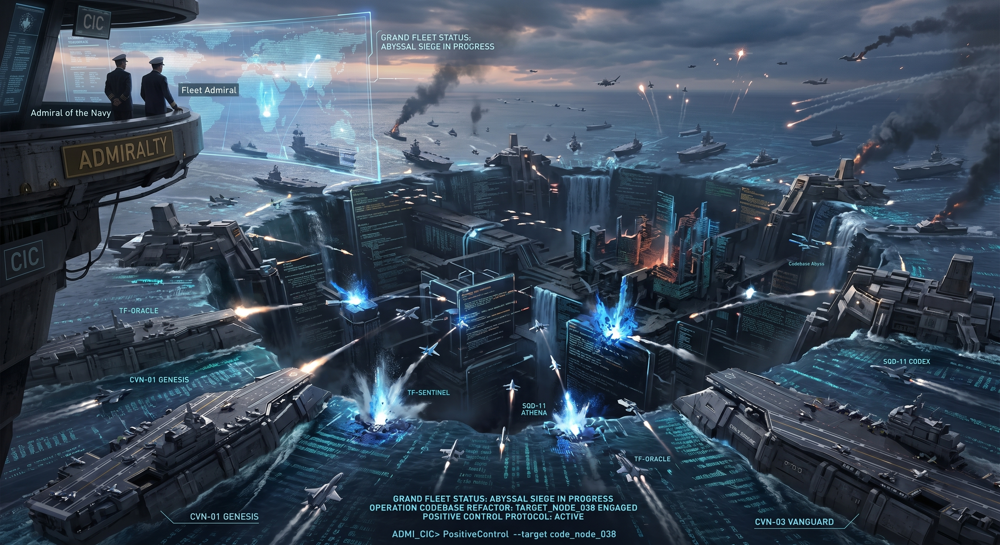

    <h1>pi-fleet</h1>
    
    <h3><em>One Fleet. All LLMs.</em></h3>

    <strong>Claude Code, Codex CLI, Gemini CLI를 하나의 통합 인터페이스로 운용하는 멀티 LLM 오케스트레이션 킷 — 네이티브 CLI를 직접 사용하며, API 래핑이나 프록싱 없음.</strong>

  <a href="README.md">English</a> |
  <a href="README.ko.md">한국어</a>

---

## 동기

각 LLM CLI는 서로 다른 강점을 가지고 있습니다 — Claude는 추론, Codex는 빠른 코드 생성, Gemini는 대용량 컨텍스트 분석. 하지만 모두 독립적으로 실행됩니다. 하나의 작업에 여러 LLM의 강점을 조합하려면 별도의 터미널을 오가며 컨텍스트를 복사하고, 결과를 수동으로 조율해야 합니다.

pi-fleet는 LLM 에이전트를 해군 **함대(Fleet)** 내의 **항공모함(Carrier)**으로 다루어 이 문제를 해결합니다. 중앙의 Admiral이 여러 Carrier를 병렬로 지휘하며, 각 Carrier는 전문화된 Captain 페르소나의 명령을 받습니다. 한 번의 명령으로 함대 전체가 함께 실행됩니다.

## 해군 함대 계층 구조

4단계 지휘 체계가 사용자, 오케스트레이터, 에이전트를 명확한 역할로 매핑합니다:

- **Admiral of the Navy (대원수)** — 사용자. 전략을 수립하고 명령을 내립니다.
- **Fleet Admiral (사령관)** — grand-fleet 모드의 다중 함대 오케스트레이터.
- **Admiral (제독)** — 워크스페이스 PI 인스턴스. 작전을 기획하고 Carrier를 배치합니다.
- **Captain (함장)** — Carrier 에이전트의 지휘관 페르소나.

**Carrier**는 독립된 설정을 가진 CLI 도구의 실행 인스턴스입니다. **Captain**은 이를 지휘하는 페르소나(예: Chief Engineer, Scout Specialist)입니다.

## 항공모함

> 각 항공모함의 설정(모델 선택, 추론 레벨 등)은 Fleet Bridge UI(`Alt+O`)에서 조정할 수 있습니다.

8개의 기본 Carrier가 각각 고유한 작전 역할을 수행합니다:

- **Nimitz** — 전략 지휘·판단. 읽기 전용 아키텍처 결정·트레이드오프 재결.
- **Kirov** — 작전 기획 브리지. 요구사항 명확화 및 Ohio에 전달할 plan_file 작성(.fleet/plans/*.md).
- **Genesis** — 수석 엔지니어. 제독 직접 지휘 하의 단발 구현.
- **Ohio** — 다단 파상 타격 집행. Kirov가 작성한 plan_file을 받아 웨이브 단위로 실행.
- **Sentinel** — QA & Security Lead. 코드 리뷰, 결함 탐지, 취약점 헌팅.
- **Vanguard** — Scout Specialist. 코드베이스 탐색, 심볼 추적, 웹 리서치.
- **Tempest** — 전방 외부 체보 타격. GitHub 인텔리전스 및 외부 레포 분석.
- **Chronicle** — Chief Knowledge Officer. 문서화, 변경 로그, 변경 영향 보고.

## 기능

### 멀티 LLM 오케스트레이션

- 통합 진행 상황 추적과 함께하는 병렬 Carrier 실행
- Carrier별 모델 및 추론 레벨 설정
- 다양한 운용 모드를 위한 프로토콜 시스템 (Fleet Action, Positive Control)

### HUD

- 상태 바와 푸터를 갖춘 통합 에디터
- 메타 프롬프팅 및 추론 레벨 컨트롤
- 자동 세션 요약 및 씽킹 타이머

### Fleet Bridge

- 모든 활성 Carrier의 실시간 스트리밍 UI
- Carrier 슬롯 간 인라인 내비게이션
- 집중 모니터링을 위한 상세 뷰 토글

### Carrier Sortie

- 단일 또는 다중 Carrier에 대한 Fire-and-forget 위임
- 단일 항모 출격은 물론 한 번의 호출로 병렬 다중 항모 출격까지 지원
- 푸시 알림 및 `carrier_jobs` 조회를 통한 비동기 결과 전달

### Squadron

- 동일 Carrier 타입의 병렬 인스턴스로 독립 하위 작업 분산
- 배치 분석 또는 파일 단위 처리를 위한 분할 정복 실행
- 디스패치당 최대 10개의 동시 하위 작업 지원

### Task Force

- 단일 Carrier의 응답을 여러 CLI 백엔드에서 동시에 교차 검증
- 접근 방식 비교, 사각지대 탐지, 멀티 모델 합의 도출

### Fleet Memory 프로토타입

- raw source, wiki entry, schema/doctrine 공간, append-only log, patch queue/archive, conflict record를 갖춘 워크스페이스 로컬 `.fleet-memory/` 저장소
- 사람이 승인하는 memory patch 흐름: ingest는 wiki 변경을 제안하고, approve가 병합하며, reject는 wiki/log를 변경하지 않음
- 관찰 가능한 검토를 위한 deterministic briefing, AAR 제안, dry-dock lint, `fleet:memory:*` slash command 제공
- 승인 대기 wiki/AAR 패치를 생성하거나 preview-only 검토로 실행할 수 있는 단계형 `fleet:memory:capture` 세션 캡처

## 명령어

`npm link` 실행 후 ([SETUP.md](SETUP.md) 참조), 4가지 전역 명령어를 사용할 수 있습니다:

| 명령어 | 설명 |
|--------|------|
| `fleet` | 표준 Fleet 모드 실행 |
| `gfleet` | Grand Fleet 모드 실행 |
| `fleet-dev` | 현재 체크아웃의 extension을 직접 로드하여 표준 Fleet 모드 실행 |
| `gfleet-dev` | 현재 체크아웃의 extension을 직접 로드하여 Grand Fleet 모드 실행 |

## 설치

자세한 설치 방법은 [SETUP.md](SETUP.md)를 참조하세요.

> **AI 에이전트로 빠른 시작** — 아래를 LLM 에이전트에 복사하여 붙여넣으세요:
>
> Install and configure pi-fleet by following the instructions here: `https://raw.githubusercontent.com/sbluemin/pi-fleet/main/SETUP.md`

## 문서

- [PI 개발 레퍼런스](./docs/pi-development-reference.md) — PI 확장 개발 및 SDK 사용을 위한 종합 가이드.
- [제독 워크플로우 레퍼런스](./docs/admiral-workflow-reference.md) — 해군 함대 아키텍처 및 운용 원칙에 대한 심층 분석.
- [CHANGELOG](./CHANGELOG.md) — 프로젝트 변경 이력 및 릴리스 노트.

## 라이선스

MIT
